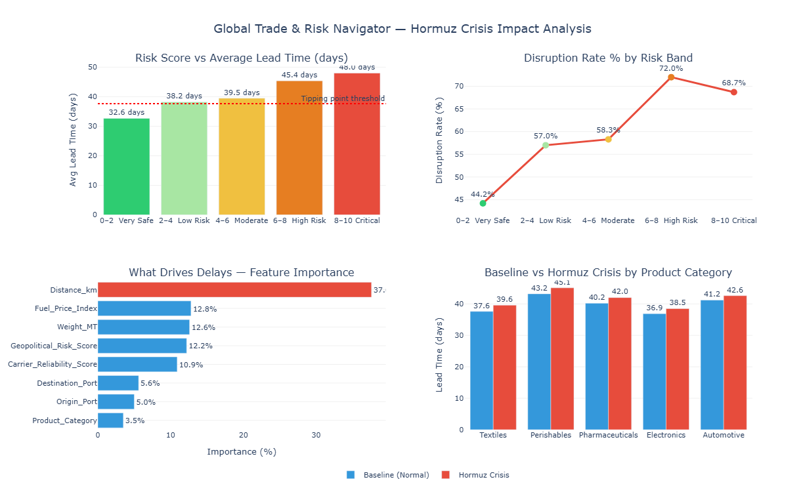

# Global Trade & Risk Navigator
### Supply Chain Risk Analysis — Hormuz Crisis 2026



---

## The Problem

In 2026, the Strait of Hormuz closed.

15-20% of the world's traded oil passes through that narrow stretch of water.
When it closed, ships had to reroute around the entire continent of Africa —
adding 2 extra weeks to every journey. Oil prices crossed $107 per barrel.
Freight costs jumped 40%.

Companies running Just-in-Time supply chains had no buffer, no warning system,
and no data-driven way to know which of their products were most at risk —
or exactly when they needed to act.

This project builds that early warning system.

---

## What This Project Does

Using real shipment data from 2024–2026 (Kaggle), this project:

- Simulates the Hormuz closure on 1,281 real sea routes
- Runs a machine learning model to find what actually drives delays
- Identifies the exact Risk Score threshold where things break
- Quantifies the impact on 5 product categories
- Delivers 3 actionable business recommendations

---

## Key Findings

**Finding 1 — The crisis adds 15.4 extra days**
Safe routes average 32.6 days. Critical zone routes average 48.0 days.
15.4 extra days is enough to shut down a Just-in-Time production line completely.

**Finding 2 — Risk Score 6.0 is the decision trigger**
Below 6.0 → monitor and prepare.
Above 6.0 → act immediately.
Above 8.0 → emergency reroute or airfreight now.

**Finding 3 — Distance drives delays, not fuel price**
Distance explains 37.6% of all delivery delays.
Fuel price explains only 12.8%.
Companies watching fuel costs as a risk signal are measuring the wrong thing.

**Finding 4 — Disruption rate jumps 24.5 percentage points**
Safe zone: 44.2% disruption rate.
Critical zone: 68.7% disruption rate.
At Risk Score 8+, nearly 7 out of 10 shipments are disrupted.

---

## Business Recommendations

| Priority | Action | Why |
|---|---|---|
| 1 | Set a Risk Score alert at 6.0 | Act before the crisis hits your warehouse |
| 2 | Hold 15 days of buffer stock on critical components | Covers the full Hormuz delay window |
| 3 | Diversify supply chain away from single corridors | Eliminates single-point-of-failure dependency |

---

## Dashboard


The dashboard shows:
- **Top left** — Lead time climbs from 32.6 to 48.0 days across risk bands
- **Top right** — Disruption rate jumps sharply above Risk Score 6
- **Bottom left** — Distance is the dominant delay driver at 37.6%
- **Bottom right** — Every product category is hit, Perishables worst

---

## Methodology
```
Step 1 → Load real Kaggle dataset (5,000 shipments, 14 variables)
Step 2 → Filter to sea routes only (1,281 shipments)
Step 3 → Inject Hormuz crisis simulation
         - Risk Score forced to 10 on Middle East routes
         - Fuel Index × 1.4
         - Lead Time + 15 days
Step 4 → Random Forest Regression — feature importance analysis
Step 5 → Tipping Point Analysis — 5 risk bands compared
Step 6 → Category Impact — baseline vs crisis per product type
```

---

## Tools Used

| Tool | Purpose |
|---|---|
| Python | Core analysis language |
| Pandas | Data loading, filtering, manipulation |
| Scikit-learn | Random Forest regression model |
| Plotly | Interactive dashboard |
| Google Colab | Cloud development environment |
| Kaggle | Real-world dataset source |

---

## Dataset

**Global Supply Chain Risk & Logistics 2024–2026**
Source: Kaggle — nudratabbas
Records: 5,000 shipments
Variables: 14 columns including Risk Score, Fuel Index,
Distance, Carrier Reliability, Disruption flag

---

## How to Run

1. Open [Google Colab](https://colab.research.google.com)
2. Upload the `.ipynb` notebook file
3. Run cells 1 through 8 in order
4. All libraries install automatically in Cell 1

---

*Analysis completed: March 30, 2026*
*Dataset: Kaggle Global Supply Chain Risk 2024–2026*
```

---

## Step 2 — Commit it

Scroll to the bottom of the editor and where it says **Commit changes** type:
```
Add professional README with findings and dashboard
